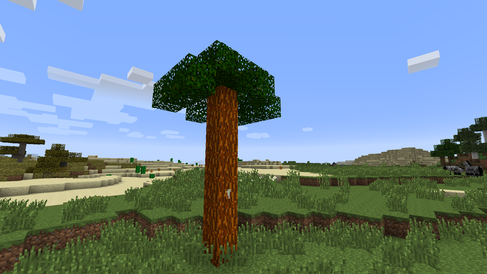

### ⚙️ Industrial Mod (Minecraft 1.7.10) (02.02.2026)

A custom industrial mod inspired by classic tech mods. I'm learning Java development by creating a complex production chain.

### ✅ Current progress:
- **Materials:** Industrial ore, blocks, and ingots.
- **Tools:** Industrial hammer (consumes durability when crafting).
- **Resources:** Metal plates (the first step to machines).
- **World:** Ore generation in the depths of the earth.

### 🛠 Today's plans:

- [ ] Final textures for new items.
- [ ] Adding a hammer impact sound.
- [ ] Full localization into Russian and English.

---
*Project in active development.*

## 📅 Iteration #2: Tools and Forging (03.02.2026)
*The second stage of development: the transition from transformation to semi-finished products.*

### What's added:
- **Tools:** Implemented `Industrial Hammer`.
- *Feature:* The item breaks, but remains in the crafting grid.
- *Sound:* Added the effect of striking an anvil during crafting.
- **Items:** Added `Industrial Plates`.
- **Recipes:** Configured shapeless forging (Ingot + Hammer = Plate).
- **Graphics:** Created custom 16x16 textures in a unified style.
- **Localization:** Added translations for all new items (RU/EN).

---
## 📅 Iteration #3: World Gen Balancing (03.02.2026)
*Optimization and preparation for large-scale industrialization.*

### Changes:
- **Ore Generation:** Rebalanced `Industrial Ore` spawn rates.
  - Reduced `chance` per chunk from 20 to 8 (matching Iron ore rarity).
  - Adjusted `veinSize` to 6 for better gameplay balance.
  - Set vertical spawn range (`minY/maxY`) to 4-48 levels.
- **Git & Docs:** Updated repository structure and added future development roadmap.
---

## 📅 Iteration #4: Metallurgy & Rubber Foundation (04.02.2026)
*The core framework for the initial industrialization stage is now complete. A full processing cycle for Copper and Tin has been implemented.*

### Changes:
*   **Resources:** Added Copper and Tin ores with world generation in the Overworld.
*   **Metallurgy:** Implemented Copper and Tin ingots with smelting mechanics.
*   **Processing:** Added Copper and Tin plates, crafted using the Industrial Hammer.
*   **Botany:** Integrated base blocks for the Rubber Tree (Log, Leaves, and Sapling) to prepare for the rubber production system.
*   **Compatibility:** Fully integrated Ore Dictionary for seamless interaction with other industrial mods (e.g., IC2, GregTech).

## 📅 Iteration #5: Rubber Tree Ecosystem and Tools (05.02.2026)
*At this stage, work on the basic mechanics of resource cultivation was completed.*

### Changes:
*   **Growth mechanics:** Implemented the `IGrowable` interface for rubber tree seedlings. Now the tree can be grown instantly using bone meal.
*   **Render fix:** Completely reworked foliage code (`BlockRubberLeaves`). Fixed transparency issue (shaders 1.7.10) and adjusted correct sapling drop (5% chance).
*   **Toolkit:** Added the “Tap” item (`Tree Tap`).
    *   Crafting via workbench implemented (5 sticks).
    *   Item durability set (64 uses).
* **Generation:** Seedling linked to unique structure generator `WorldGenRubberTree` to preserve tree identity when grown manually.
* **Stability:** Reorganized the main mod class, fixed the order of item and block initialization to prevent recipe registration errors.

## 📅 Iteration #6: Unique rubber tree and localization (06.02.2026)
*At this stage, the unique rubber harvesting mechanic was fully implemented and multilingual support was added.*

### Changes:
*   **Unique palm tree generator**: The shape of the trees was changed from oak to palm (tall trunk, dense crown). The spawn rate in normal biomes was reduced to 1%.
*   **Latex mechanics**: Latex spots now only appear on the **north side** of the trunk when the tree is generated (20% chance). .
*   **Tool balancing**: The durability of the “Tap” has been reduced to **32** uses. Random latex drops have been added (**1 to 3** units per collection).
*   **Production**: Added the item “Rubber” (`itemRubber`) and a recipe for smelting latex in a furnace.
*   **Localization**: Added `en_US.lang` and `ru_RU.lang` files with full translations of all new items and blocks.

<h2 align="center">📸 Mod Preview</h2>

  <table align="center">
    <tr>
      <td align="center" valign="top">
        
         
        <b>Rubber Palm</b> Unique tree generation
      </td>
      <td align="center" valign="top">
        
         
        <b>Latex Extraction</b> Using the Tree Tap
      </td>
      <td align="center" valign="top">
        
         
        <b>New Items</b> Latex & Tools
      </td>
    </tr>
  </table>

